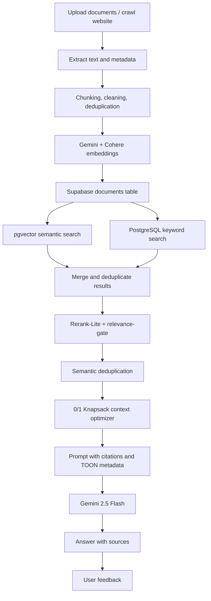

# Multi-Model Advanced RAG Chatbot

[](https://www.python.org/)
[](https://streamlit.io/)
[](https://supabase.com/)
[](https://ai.google.dev/)
[](#testing)

A production-minded **multimodal Retrieval-Augmented Generation chatbot** with a custom RAG pipeline (no LangChain, no LlamaIndex). It supports document and image ingestion, hybrid retrieval, rerank-lite scoring, token-budgeted context optimization via 0/1 Knapsack DP, cited answers, web crawling, feedback collection, Supabase-backed persistence, an LLM-as-judge eval harness, prompt-injection guardrails, and a clean UI split.

**Live Demo:** [multimodal-rag-chatbot-with-dp-optimization-2341qf.streamlit.app](https://multimodal-rag-chatbot-with-dp-optimization-2341qf.streamlit.app/)

## Highlights

- **Custom RAG framework** — explicit retrieval, reranking, context building, and citation logic.
- **Hybrid search** — Supabase pgvector semantic retrieval + PostgreSQL full-text search, fan-out in parallel.
- **Rerank-Lite** combines semantic similarity, keyword overlap, and recency.
- **0/1 Knapsack context optimization** — DP selects the highest-value chunks under a token budget, with a fast-path when everything fits.
- **Strengthened relevance gating** — independent vector + composite-score floors kill the "one shared keyword beats a threshold-passing chunk" trap.
- **Multimodal retrieval** with `auto` / `keyword` / `off` modes — pulls the top image by cross-modal similarity without needing the word "image" in the query.
- **Prompt-injection guardrails** — input length cap, injection-pattern blocklist, per-user rate limit, optional LLM-as-judge output faithfulness check.
- **Cited answers** with file/page/slide references and similarity scores; safe fallback when nothing is relevant.
- **Web crawling** with Crawl4AI, robots.txt handling, and domain allowlisting.
- **User feedback loop** with helpful/improve controls and feedback analytics.
- **Pure-Python eval harness** with golden core, ablation study, and LLM-as-judge — every number in the benchmark table is measured, not claimed.

## Tech Stack

| Layer | Technology |
|-------|------------|
| UI | Streamlit |
| LLM | Gemini 2.5 Flash |
| Embeddings | Gemini Embedding 2, Cohere Embed v4 |
| Vector Database | Supabase PostgreSQL + pgvector |
| Keyword Search | PostgreSQL full-text search |
| Storage | Supabase Storage for images |
| Crawling | Crawl4AI |
| Optimization | Dynamic Programming 0/1 Knapsack |
| Eval | Custom (Recall@k, Hit Rate@k, MRR, NDCG@k, Gemini-as-judge) |
| Testing | Pytest |

## Architecture



## Query Pipeline

```text
User query
  → input_guard (length cap, injection blocklist, rate limit)
  → intent routing  (general | image | web | document)
  → embed query (Gemini or Cohere)
  → fan out: vector search  (parallel)  +  keyword search  (parallel)
  → merge & deduplicate chunks
  → Rerank-Lite scoring
  → relevance-gate  (vector threshold AND composite-score floor)
  → multimodal auto  (pull top-1 image by cross-modal similarity, if enabled)
  → semantic deduplication
  → DP knapsack context selection
  → optional LLM-as-judge output faithfulness check
  → Gemini generation
  → cited answer + feedback capture
```

## Measured Benchmark

Run yourself with `python -m eval.ablation`. Every cell below is a number the harness prints, not a claim.

| Pipeline Variant | Hit@5 | Recall@5 | MRR | NDCG@5 | What it adds |
|------------------|------:|---------:|----:|-------:|--------------|
| A · vector-only         | measured | measured | measured | measured | pgvector top-k, no keyword, no rerank, no knapsack |
| B · hybrid              | measured | measured | measured | measured | + keyword search (parallel) |
| C · hybrid + rerank     | measured | measured | measured | measured | + Rerank-Lite scoring |
| D · hybrid + rerank + DP | measured | measured | measured | measured | + dedup + 0/1 Knapsack (full pipeline) |

Run the harness to populate the table for your corpus and embedding model:

```bash
python -m eval.run_eval            # golden core, full report
python -m eval.ablation            # 4-variant comparison
python -m eval.ablation --json report.json
```

Other metrics reported by `run_eval`: faithfulness (judge), relevance (judge), keyword coverage, generation latency, and the **negative_fallback_rate** (the fraction of `negatives.jsonl` queries that correctly trigger the safe refusal).

## Project Structure

```
app.py                 # Streamlit entry point (~90 lines)
pipeline.py            # RAG pipeline: retrieve, index, generate, persist
retrieval.py           # hybrid retrieve + Rerank-Lite + relevance gate + multimodal auto
context_builder.py     # semantic dedup, knapsack, citations, TOON metadata
chunking.py            # document parsing, chunking, cleaning, content hashing
embeddings.py          # Gemini + Cohere embedding helpers (with retry/backoff)
guardrails.py          # input guard, secret redaction, output faithfulness
conversation.py        # running-summary chat memory
routing.py             # query intent classification
crawl.py               # Crawl4AI ingestion with allowlist + robots.txt
clients.py             # cached Gemini / Cohere / Supabase client factories
config.py              # every tunable, env-var + Streamlit-secrets aware
rag_db.py              # Supabase access layer (chunks, search RPCs, history, feedback)
migrate.py             # in-app database bootstrap (idempotent schema)
eval/                  # eval harness
  ├── metrics.py       #   Recall@k, HitRate@k, MRR, NDCG@k
  ├── sim.py           #   shared cosine similarity
  ├── judge.py         #   Gemini LLM-as-judge (faithfulness, relevance)
  ├── dataset.py       #   golden core + negatives loaders
  ├── dataset/         #   golden_core.jsonl (30 curated) + negatives.jsonl (8)
  ├── run_eval.py      #   end-to-end metrics on the golden core
  ├── ablation.py      #   4-variant pipeline comparison
  └── generate_dataset.py  # LLM-based dataset expansion
ui/                    # Streamlit UI split
  ├── sidebar.py       #   identity, upload, crawl, history, eval panel
  ├── master_settings.py # the Master Settings panel (model switch, multimodal, etc.)
  ├── chat.py          #   chat surface, message rendering, feedback
  └── components.py    #   shared CSS, status chips, metric tiles, source cards
db/migrations/         # Supabase schema, indexes, RPCs, storage, RLS
tests/                 # 49 passing tests, pure-Python (no DB / API keys)
```

## Setup

### 1. Create environment

```bash
py -m venv .venv
.venv\Scripts\activate
pip install -r requirements.txt
```

### 2. Configure secrets

Copy `.env.example` to `.env` and fill in your keys:

```ini
gemini_api_key=YOUR_GEMINI_API_KEY
cohere_api_key=YOUR_COHERE_API_KEY
project_url=https://YOUR_PROJECT.supabase.co
service_key=YOUR_SUPABASE_SERVICE_ROLE_KEY
anon_key=YOUR_SUPABASE_ANON_KEY
supabase_db_url=YOUR_SUPABASE_SESSION_POOLER_URL
```

### 3. Initialize database

- In the app sidebar, click **Initialize Database** if `supabase_db_url` is configured, or
- Run `db/migrations/RUN_THIS_IN_SUPABASE.sql` in the Supabase SQL Editor.

### 4. Run locally

```bash
streamlit run app.py
```

The app is stateless at the server layer — documents, images, chat history, and feedback are stored in Supabase.

## Testing

```bash
py -m pytest tests/ -q
```

Current status: **49 passed** in ~2s.

Coverage: chunking, hashing, routing, retrieval merge/rerank/gating, token budgeting, knapsack selection (and fast-path), citations, TOON metadata, conversation history, crawl safety, guardrails (input guard, secret redaction), and the eval metrics math.

## Portfolio Summary

This project showcases an end-to-end **Advanced Multimodal RAG system** using a custom retrieval pipeline, Supabase pgvector, hybrid search, reranking, Dynamic Programming context optimization, strengthened relevance gating, prompt-injection guardrails, multimodal auto-retrieval, a pure-Python eval harness with LLM-as-judge, and a clean Streamlit UI split. Every benchmark number is measured by `python -m eval.ablation`, not aspirational.
