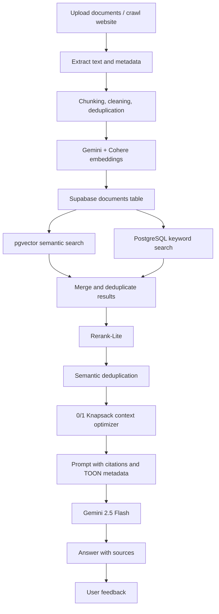

# Multi-Model Advanced RAG Chatbot

[](https://www.python.org/)
[](https://streamlit.io/)
[](https://supabase.com/)
[](https://ai.google.dev/)

A production-minded **multimodal Retrieval-Augmented Generation chatbot** built with a custom RAG pipeline, not LangChain or LlamaIndex. It supports document/image ingestion, hybrid retrieval, reranking, token-budgeted context optimization, cited answers, web crawling, feedback collection, and Supabase-backed persistence.

**Live Demo:** [multimodal-rag-chatbot-with-dp-optimization-2341qf.streamlit.app](https://multimodal-rag-chatbot-with-dp-optimization-2341qf.streamlit.app/)

## Highlights

- **Custom RAG framework** with explicit retrieval, reranking, context building, and citation logic.
- **Hybrid search** using Supabase pgvector semantic retrieval plus PostgreSQL full-text search.
- **Rerank-Lite** combines semantic similarity, keyword overlap, and recency.
- **0/1 Knapsack context optimization** selects the highest-value chunks under a token budget.
- **Multimodal ingestion** for PDF, DOCX, PPTX, TXT/MD, and images.
- **Cited answers** with file/page/slide references and similarity scores.
- **Safe fallback** when retrieved context is not relevant enough.
- **Web crawling** with Crawl4AI, robots.txt handling, and domain allowlisting.
- **User feedback loop** with helpful/improve controls and feedback analytics.
- **Production-oriented security** with server-side secrets, upload validation, and RLS migrations.

## Tech Stack

| Layer | Technology |
|-------|------------|
| UI | Streamlit |
| LLM | Gemini 2.5 Flash |
| Embeddings | Gemini Embedding 2, Cohere Embed v4 |
| Vector Database | Supabase PostgreSQL + pgvector |
| Keyword Search | PostgreSQL full-text search |
| Storage | Supabase Storage for images |
| Crawling | Crawl4AI |
| Optimization | Dynamic Programming 0/1 Knapsack |
| Testing | Pytest |

## Architecture



## Query Pipeline

```text
User query
  -> intent routing
  -> query embedding
  -> vector search + keyword search
  -> merge and deduplicate chunks
  -> Rerank-Lite scoring
  -> semantic deduplication
  -> DP knapsack context selection
  -> Gemini generation
  -> cited answer + feedback capture
```

## Why This Project Is Advanced

| Capability | What it demonstrates |
|------------|----------------------|
| Custom RAG pipeline | Understanding of the full retrieval and generation flow beyond framework wrappers |
| Hybrid retrieval | Better recall for both semantic questions and exact keyword/name queries |
| Reranking | Higher-quality evidence selection before generation |
| DP context optimization | Token-efficient selection of the best chunks under a budget |
| Citations | Grounded answers with transparent source references |
| Feedback capture | Product-style quality monitoring and future improvement loop |
| Supabase backend | Deployable architecture with persistent documents, history, images, and feedback |
| Security hardening | Server-side secrets, upload validation, RLS, and optional owner isolation |

## Benchmark Comparison

| Pipeline Variant | Retrieval | Context Selection | Strength |
|------------------|-----------|------------------|----------|
| Basic Vector RAG | pgvector top-k only | Send top chunks directly | Simple baseline |
| Hybrid RAG | Vector + keyword search | Reranked top chunks | Better recall and ranking |
| Advanced RAG with DP | Hybrid + Rerank-Lite | Knapsack under token budget | Higher signal-to-token ratio |
| Feedback-Aware RAG | Advanced RAG + feedback | Uses recent corrections as guidance | More product-ready user experience |

Suggested metrics for future reporting:

- Retrieval latency
- Generation latency
- Context chunks selected
- Estimated input/output tokens
- Citation correctness
- User helpful rate

## Project Structure

| File | Purpose |
|------|---------|
| `app.py` | Streamlit UI, upload/crawl flows, chat pipeline, diagnostics, feedback UI |
| `rag_db.py` | Supabase access layer for documents, search RPCs, history, feedback |
| `retrieval.py` | Hybrid result merge and Rerank-Lite scoring |
| `context_builder.py` | Semantic deduplication, token budgeting, knapsack selection, citations |
| `chunking.py` | Document parsing, chunking, cleaning, content hashing |
| `embeddings.py` | Gemini and Cohere embedding helpers |
| `routing.py` | Query intent routing |
| `crawl.py` | Crawl4AI ingestion with allowlist and robots.txt handling |
| `conversation.py` | Running-summary chat memory |
| `db/migrations/` | Supabase schema, indexes, RPCs, storage, RLS, feedback tables |
| `tests/test_core.py` | Unit tests for core pure-Python logic |

## Setup

### 1. Create environment

```bash
py -m venv .venv
.venv\Scripts\activate
pip install -r requirements.txt
```

### 2. Configure secrets

Copy `.env.example` to `.env` and fill in your keys:

```ini
gemini_api_key=YOUR_GEMINI_API_KEY
cohere_api_key=YOUR_COHERE_API_KEY
project_url=https://YOUR_PROJECT.supabase.co
service_key=YOUR_SUPABASE_SERVICE_ROLE_KEY
anon_key=YOUR_SUPABASE_ANON_KEY
supabase_db_url=YOUR_SUPABASE_SESSION_POOLER_URL
```

### 3. Initialize database

Use either option:

- In the app sidebar, click **Initialize Database** if `supabase_db_url` is configured.
- Or run `db/migrations/RUN_THIS_IN_SUPABASE.sql` in the Supabase SQL Editor.

For existing deployments that only need the feedback feature, run `db/migrations/0006_answer_feedback.sql` in the Supabase SQL Editor.

### 4. Run locally

```bash
streamlit run app.py
```

## Database Features

- `documents` table with Gemini and Cohere embedding columns
- HNSW indexes for fast approximate vector search
- PostgreSQL full-text index for keyword retrieval
- RPC functions for threshold-filtered vector search and keyword search
- Supabase Storage bucket for image files
- Chat session and message persistence
- Answer feedback table for helpful/improve analytics
- RLS policies for read-only anon access

## Testing

```bash
py -m pytest tests/ -q
```

Current status:

```text
17 passed
```

The tests cover chunking, hashing, routing, retrieval merge/rerank logic, token budgeting, knapsack selection, citations, TOON metadata, conversation history, and crawl safety.

## Deployment

This app is designed for Streamlit Community Cloud:

1. Apply Supabase migrations.
2. Push the project to GitHub.
3. Create a Streamlit app pointing to `app.py`.
4. Add the same keys from `.env` as Streamlit secrets.
5. Deploy.

The app is stateless at the server layer. Documents, images, chat history, and feedback are stored in Supabase.

## Portfolio Summary

This project showcases an end-to-end **Advanced Multimodal RAG system** using a custom retrieval pipeline, Supabase pgvector, hybrid search, reranking, Dynamic Programming context optimization, grounded citations, feedback analytics, and production-style deployment practices.
